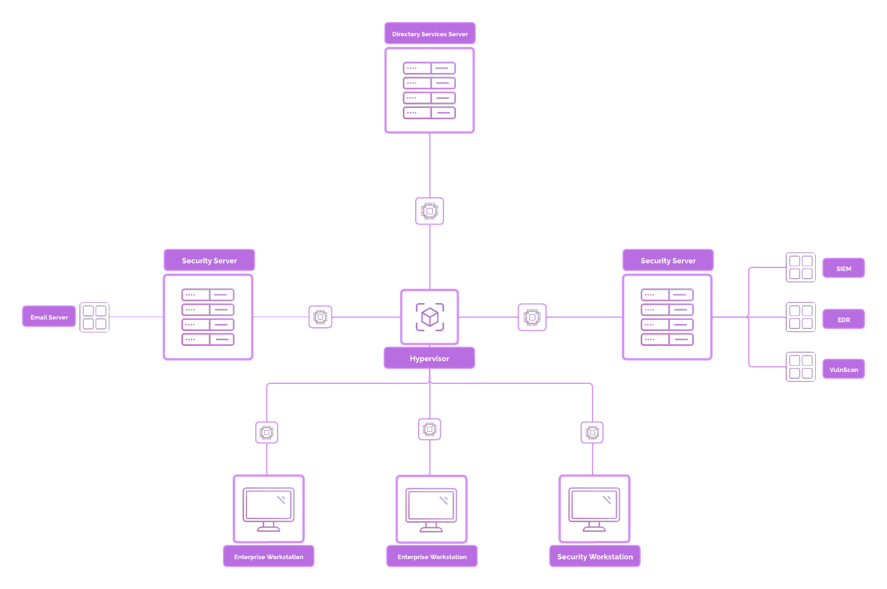

# 3. Project Architecture

---

### 🗺️ Architecture Diagram

---

### 🌍 NAT Configuration

For this project, a **VirtualBox NAT Network** was created to allow communication between all virtual machines and simulate an internal enterprise network. The NAT setup makes it easy to manage traffic without needing a physical router or internet access for every VM.

- **Network Name:** `Project-X-NAT`
- **Network Type:** NATNetwork
- **IP Address Range:** `10.0.0.0/24`
- **Usable IP Range:** `10.0.0.1 – 10.0.0.254`
- **DHCP Dynamic Scope:** `10.0.0.100 – 10.0.0.200`

The **attacker machine** is also part of this NAT network, allowing it to interact with all other hosts in the simulated environment (e.g., for scanning, exploitation, and lateral movement). This setup helps mimic a real-world internal attack scenario.

---

### 📦 VirtualBox Setup

All virtual machines for this project were created and managed using **Oracle VirtualBox (v7.x)**, a free and open-source virtualization platform. VirtualBox was used to simulate a small enterprise environment on a single physical host machine.

**VM Management**

- A total of **7 virtual machines** were deployed:
    - Domain Controller (Windows Server 2025)
    - Windows Workstation (Windows 11 Enterprise)
    - Linux Workstation (Ubuntu Desktop 22.04)
    - Email Server (Ubuntu Server 22.04)
    - Security Server (Ubuntu Desktop 22.04)
    - Security Workstation (Security Onion)
    - Attacker Machine (Kali Linux 2024.2)
- VMs were organized based on their function (server, client, attacker, security).
- Each VM was attached to a **custom NAT Network** (`Project-X-NAT`) to ensure internal communication.
- Snapshots were regularly used throughout the project to preserve VM states before major changes, such as software installations or adversarial simulations.
- Features like **Guest Additions**, **shared clipboard**, and **drag-and-drop** were enabled on supported VMs to enhance usability during configuration.

---

### ⚙️ VM Specifications

The following table shows the resource allocation for each virtual machine used in the environment. Specifications were assigned based on the functional requirements of each system, balancing performance with available host resources.

| **VM Name** | **Operating System** | **Specs (CPU / RAM)** | **Storage (Min.)** |
| --- | --- | --- | --- |
| `project-x-dc` | Windows Server 2025 | 2 CPU / 4096 MB | 50 GB |
| `project-x-win-client` | Windows 11 Enterprise | 2 CPU / 4096 MB | 80 GB |
| `project-x-linux-client` | Ubuntu 22.04 Desktop | 1 CPU / 2048 MB | 80 GB |
| `project-x-sec-work` | Security Onion | 1 CPU / 2048 MB | 55 GB |
| `project-x-sec-box` | Ubuntu 22.04 Desktop | 2 CPU / 4096 MB | 80 GB |
| `project-x-corp-svr` | Ubuntu 22.04 Desktop | 2 CPU / 4096 MB | 80 GB |
| `project-x-attacker` | Kali Linux 2024.2 | 1 CPU / 2048 MB | 55 GB |

> **Note:** All VMs were **not running simultaneously**. Only the virtual machines required for a specific phase or task were powered on at one time to conserve system resources.
> 

---

### 🧩 IP Addressing Scheme

The following table outlines the IP address allocation and roles for all machines in the virtual network. Critical services like the Domain Controller and Email Server use static IPs, while workstations and testing environments may receive dynamic addresses within the NAT DHCP range (`10.0.0.100 – 10.0.0.200`).

| **Hostname** | **IP Address** | **Function** |
| --- | --- | --- |
| `project-x-dc` *(corp.project-x-dc.com)* | `10.0.0.5` | Domain Controller (DNS, DHCP, SSO) |
| `project-x-corp-svr` | `10.0.0.8` | Docker Running SMTP container |
| `project-x-sec-box` | `10.0.0.10` | Dedicated Security Server (Wazuh, etc.) |
| `project-x-sec-work` | `10.0.0.103` or *Dynamic* | Security Playground / Analyst Workstation |
| `project-x-win-client` | `10.0.0.100` or *Dynamic* | Windows Workstation |
| `project-x-linux-client` | `10.0.0.101` or *Dynamic* | Linux Desktop Workstation |
| `project-x-attacker` | *Dynamic* | Attacker Environment (Kali Linux) |

> **Note:** Machines marked as *Dynamic* receive their IPs via DHCP from the NAT network. Static IPs were manually assigned for core infrastructure services to ensure stability and consistent communication.
>