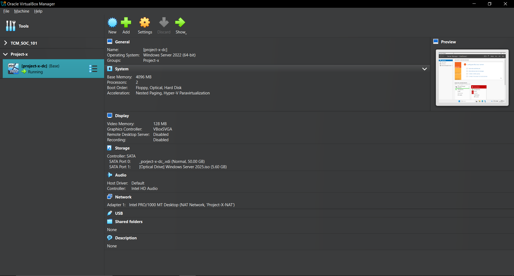

# 4. Host Configuration

---

This section outlines the key virtual machines (VMs) in the cyber range environment, their roles, and how they contribute to the simulated enterprise setup. Each host was configured to reflect a realistic system in a small-to-mid-sized business network.

### 🏰 **1. Domain Controller – `project-x-dc`**

- **OS:** Windows Server 2025
- **IP Address:** 10.0.0.5 (Static)
    
    
    
- **Function:**
    - Centralized **Active Directory Domain Services (AD DS)**
    - **DNS** and **DHCP** server for the internal network
    - Handles **user authentication**, **group policy**, and **SSO** (Single Sign-On)

---

### 📬 **2.** Jumpbox (Email Server)- **`project-x-corp-svr`**

- **OS:** Ubuntu Desktop 22.04
- **IP Address:** 10.0.0.8
    
    
    
- **Function:**
    - Run Docker
    - Acts as an entry-point into an isolated environment .
    - The user will be able to access types of services like FTP, DNS and email(SMTP)
    - Used as a security mechanism to restrict the access to the internet environment

---

### 🛡️ **3. Security Server – `project-x-sec-box`**

- **OS:** Ubuntu Desktop 22.04
- **IP Address:** 10.0.0.10 (Static)
    
    
    
- **Function:**
    - Hosts various **defensive tools** (e.g., Wazuh dashboard, file/log storage)
    - Collects logs and alerts from across the network
    - Provides a base for manual triage or log inspection

---

### 🧪 **4. Security Workstation – `project-x-sec-work`**

- **OS:** Security Onion
- **IP Address:** 10.0.0.103 (or Dynamic)
    
    
    
- **Function:**
    - Used by the simulated SOC analyst
    - Runs **Security Onion** for intrusion detection and log correlation
    - Visualizes alerts, timelines, and raw packet captures
    - It is not connected to AD DS server. It is setup as a third point of view . It is better to not connect it to the daily production server for security reasons.

---

### 👨‍💻 **5. Client Machines**

1. 🪟 Windows Workstation – `project-x-win-client`
    
    
    
    - **OS:** Windows 11 Enterprise
    - **IP Address:** 10.0.0.100 (or Dynamic)
        
        
        
    - **Function:**
        - Represents a standard **business user endpoint**
        - Used for attack simulation (e.g., phishing, privilege escalation)

1. 🐧 Linux Workstation – `project-x-linux-client`
    
    
    
    - **OS:** Ubuntu Desktop 22.04
    - **IP Address:** 10.0.0.101 (or Dynamic)
        
        
        
    - **Function:**
        - Simulates a **developer or engineering workstation**
        - Targeted for lateral movement and internal exploitation scenarios

---

### 💀  6**. Attacker Machine – `project-x-attacker`**

- **OS:** Kali Linux 2024.2
- **IP Address:** Dynamic (DHCP-assigned)
- **Function:**
    - Simulates the **adversary environment**
    - Hosts offensive tools for initial access, exploitation, and post-exploitation
    - Can interact with all internal hosts for testing attack scenarios

---

> Note: All VMs were configured to allow internal communication via the “Project-X-NAT” NAT Network and participated in various simulations based on their roles.
>