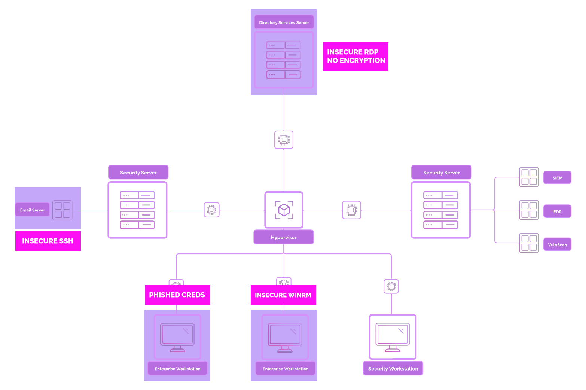

# 7. Creating A Vulnerable Environment

---

### Architecture



---

### Open SSH on `[project-x-corp-svr]`

Update system and install `openssh` if it is not yet installed (should already be installed).

`sudo apt update
sudo apt install openssh-server -y`

Enable the SSH Server and ensure it runs on boot.

`sudo systemctl start ssh
sudo systemctl enable ssh`

Change UFW rules to allow SSH connections:

`sudo ufw allow 22
sudo ufw enable
sudo ufw status`


Verify SSH is running:

`sudo systemctl status ssh`


---

### Open SSH on `[project-x-linux-client]`

Update system and install `openssh` if it is not yet installed (should already be installed)

`sudo apt update
sudo apt install openssh-server -y`

Enable the SSH Server and ensure it runs on boot.

`sudo systemctl start ssh
sudo systemctl enable ssh`

Change UFW rules to allow SSH connections:

`sudo ufw allow 22
sudo ufw status`

Verify SSH is running:

`sudo systemctl status ssh`

Enable Password Authentication. Open the SSH configuration file:

`sudo nano /etc/ssh/sshd_config`

Locate the line for PasswordAuthentication. Uncomment if commented.

`sudo nano /etc/ssh/sshd_config`


Restart SSH service:

`sudo systemctl restart ssh`

Set root’s password (use the password: november)

`sudo passwd root`

---

### Configure SMTP Email Inbox Connection from `[project-x-corp-svr]` to `[project-x-linux-client]`

Ensure the MailHog container is running in `[project-x-corp-svr]`.

`cd /home/mailhog`

Run the container with `sudo docker compose up -d`. - `-d`: Runs in detached mode.


On the `[project-x-linux-client]` host, let's ensure we have and can run the `email_poller.sh` script.

Go to the `home` directory: `cd /home`.

We can run this script in the background with: `./email_poller.sh &`.

- Stop the script if needed with: `pkill -f email_poller`


---

### Enable WinRM on `[project-x-win-client]`

Log into [project-x-win-client], open a new Administrator Powershell session.


Type the following commands to enable WinRM.

```powershell
powershell -ep bypass
Enable-PSRemoting -force
winrm quickconfig -transport:https
Set-Item wsman:\localhost\client\trustedhosts *
net localgroup "Remote Management Users" /add administrator
Restart-Service WinRM
```

---

### Enable RDP on `[project-x-dc]`

Go to “Settings” ➔ “System” ➔ “Remote Desktop”.


Toggle Remote Desktop to “On”:


---

### Setup “Sensitive File” `[project-x-dc]`

Log into `[project-x-dc]` go to `C:\Users\Administrator\Documents` ➔ Right-click ➔ New Folder ➔ Name it “ProductionFiles”.

Navigate inside the folder ➔ Right-click ➔ “New” ➔“Text File” ➔ Name the file “secrets”.

Add whatever content you would like. For this example, we add :`DEE BOO DAH`


---

### Exfiltration to `[project-x-attacker]`

The `scp` (Secure Copy) command-line utility allows you to copy files and directories between two systems over the SSH protocol.

This tool will be used to exfiltrate the secrets.txt file to our `[project-x-attacker]` machine.

Enable SSH on Kali Machine:

`sudo systemctl start ssh.service`

Create a new file under the Kali Machine, this is where we will copy our *secrets.txt* file to:

`touch /home/attacker/my_exfil.txt`