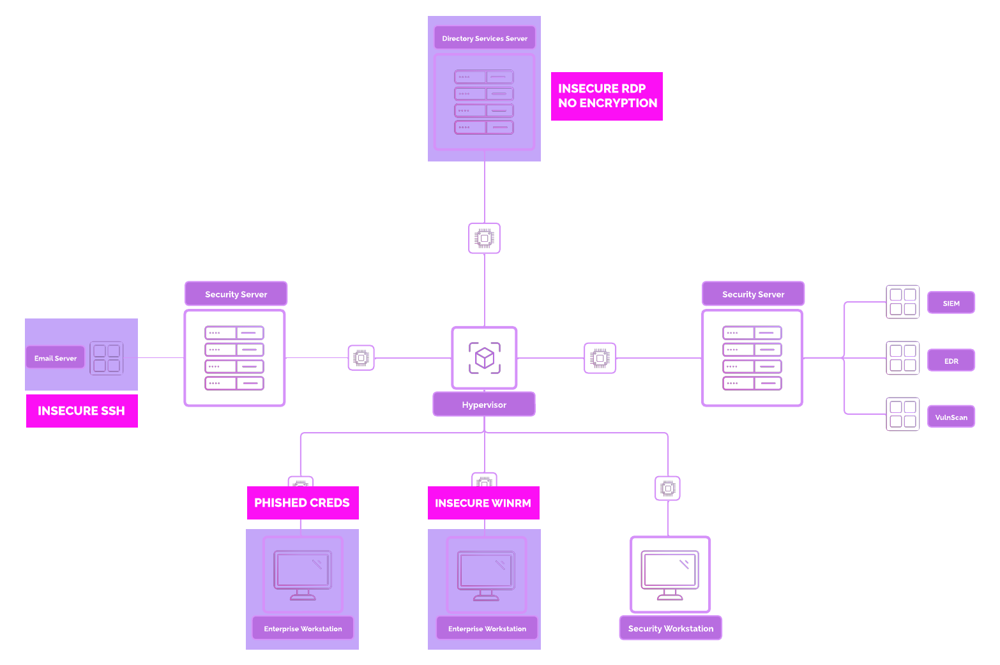
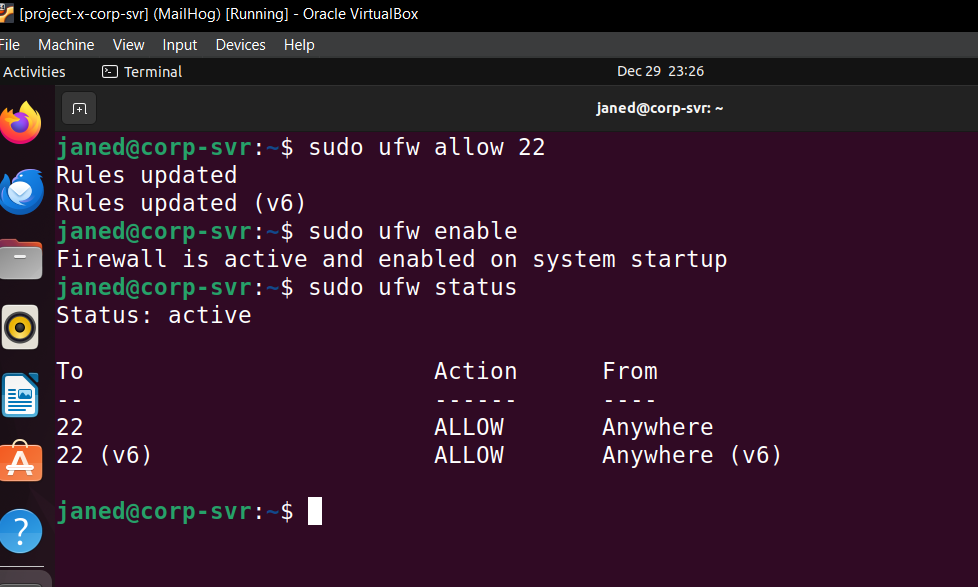
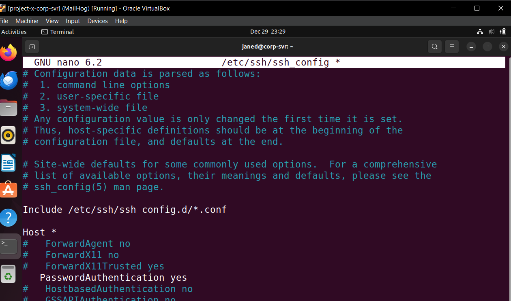
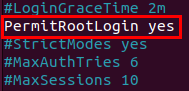
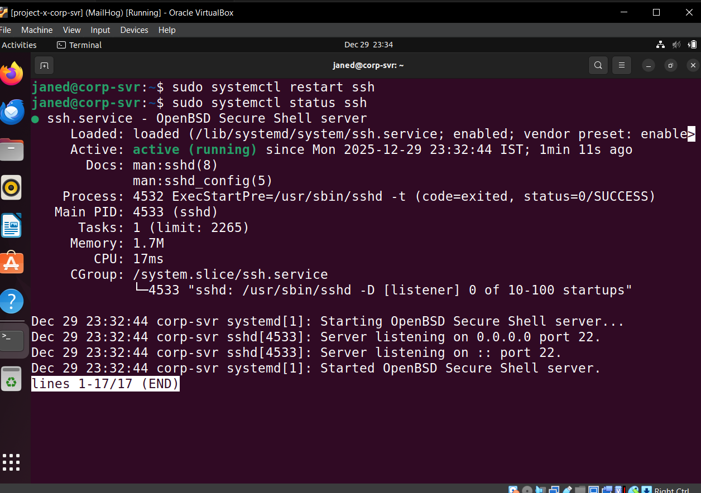
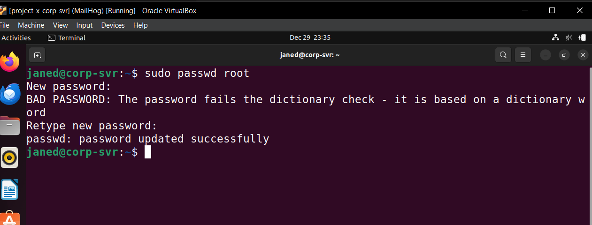
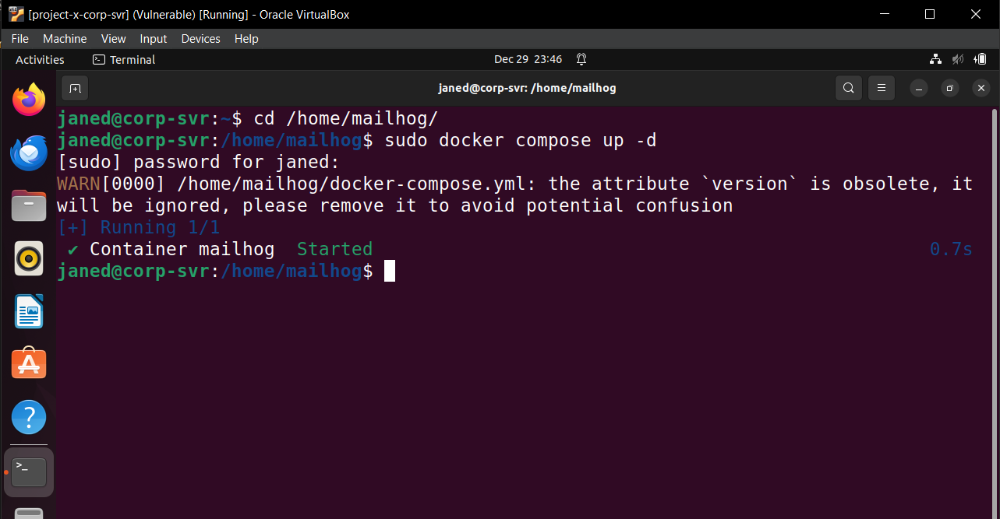
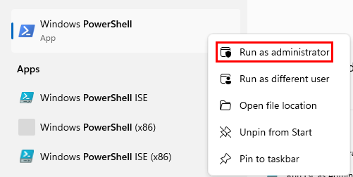
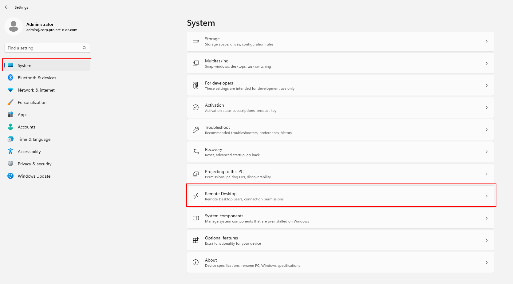

# Creating A Vulnerable Environment

---

### Network Topology



## **Vulnerable Environment**

Now we are going to perform configuration changes to make our environment ‘vulnerable’. Depending on the size, scale, and complexity of a business network, attackers will often leverage insecure and default configurations to their advantage. Even though these configurations appear to be obviously insecure, we will still see some of these in production environments. Often times, this is due to legacy systems, forgotten infrastructure, urgency, or laziness (that one would be me).

### 1. Open SSH on **`[project-x-corp-svr]`**

1. Update system and install `openssh`
    
    ```bash
    sudo apt update
    sudo apt install openssh-server -y
    ```
    
2. Enable the SSH Server and ensure it runs on boot.
    
    ```bash
    sudo systemctl start ssh
    sudo systemctl enable ssh
    ```
    
    
    
3. Change UFW rules to allow SSH connections:
    
    ```bash
    sudo ufw allow 22
    sudo ufw enable
    sudo ufw status
    ```
    
    
    
4. Open the SSH configuration file:
    
    ```bash
    sudo nano /etc/ssh/sshd_config
    ```
    
5. Locate the line for `PasswordAuthentication` and uncomment it.
    
    
    
6. Permit root login. Navigate to the `#PermitRootLogin` block. Uncomment and delete `prohibit-password` statement, change to `yes`.
    
    
    
7. Restart SSH service:
    
    ```bash
    sudo systemctl restart ssh
    ```
    
    
    
8. Set root’s password. * Set password: `november` 
    
    ```bash
    sudo passwd root
    ```
    
    
    

---

### 2. **Open SSH on `[project-x-linux-client]`**

1. Update system and install `openssh` if it is not yet installed.
    
    ```bash
    sudo apt update
    sudo apt install openssh-server -y
    ```
    
2. Enable the SSH Server and ensure it runs on boot.
    
    ```bash
    sudo systemctl start ssh
    sudo systemctl enable ssh
    ```
    
3. Change UFW rules to allow SSH connections:
    
    ```bash
    sudo ufw allow 22
    sudo ufw enable
    sudo ufw status
    ```
    
4. Open the SSH configuration file:
    
    ```bash
    sudo nano /etc/ssh/sshd_config
    ```
    
5. Locate the line for `PasswordAuthentication` and uncomment it.
    
    
6. Permit root login. Navigate to the `#PermitRootLogin` block. Uncomment and delete `prohibit-password` statement, change to `yes`.
    
    
7. Restart SSH service:
    
    ```bash
    sudo systemctl restart ssh
    ```
    
8. Set root’s password. * Set password: `november` 
    
    ```bash
    sudo passwd root
    ```
    

---

### 3. **Configure SMTP Email Inbox Connection from `[project-x-corp-svr]` to `[project-x-linux-client]`**

1. Ensure the MailHog container is running in `[project-x-corp-svr]`.
    
    ```bash
    cd /home/mailhog
    ```
    
2. Run the container with `sudo docker compose up -d`. - `-d`: Runs in detached mode.
    
    ```bash
    sudo docker compose up -d
    ```
    
    
    
3. On the `[project-x-linux-client]` host, let's ensure we have and can run the `email_poller.sh` script.
4. 

---

### 4. **Enable WinRM on `[project-x-win-client]`**

1. Log into **`[project-x-win-client]`**, open a new Administrator Powershell session.
    
    
    
2. Type the following commands to enable WinRM
    
    ```powershell
    powershell -ep bypass
    Enable-PSRemoting -force
    winrm quickconfig -transport:https
    Set-Item wsman:\localhost\client\trustedhosts *
    net localgroup "Remote Management Users" /add administrator
    Restart-Service WinRM
    ```
    

---

### 5. **Enable RDP on `[project-x-dc]`**

1. Go to “Settings” ➔ “System” ➔ “Remote Desktop”.
    
    
    
2. Toggle Remote Desktop to “On”:
    
    
    

---

### 6. **Setup “Sensitive File” `[project-x-dc]`**

1. Log into `[project-x-dc]` go to `C:\Users\Administrator\Documents` ➔ Right-click ➔ New Folder ➔ Name it “ProductionFiles”.
    
    
2. Navigate inside the folder ➔ Right-click ➔ “New” ➔“Text File” ➔ Name the file “secrets”.
    
    
    
3. Add some data to the file.
    
    

---

### 7. **Exfiltration to `[project-x-attacker]`**

The `scp` (Secure Copy) command-line utility allows a user to copy files and directories between two systems over the SSH protocol. This tool will be used to exfiltrate the secrets.txt file to `[project-x-attacker]` machine.

1. Enable SSH on Kali Machine:
    
    ```bash
    sudo systemctl start ssh.service
    ```
    
2. Create a new file under the Kali Machine, this is where we will copy our *secrets.txt* file to:
    
    ```bash
    touch /home/attacker/my_exfil.txt
    ```