# Setting Up Detections and Alerts

---

## [project-x-linux-client]

1. Wazuh has a built-in rule detection to detect authentication failures from the sshd daemon.
- Wazuh Rule ID: `5760`.
- Description: `sshd: authentication failed`.
1. Navigate to “Server management” ➔ “Rules”. And look up “5760” to view more detail about this rule.


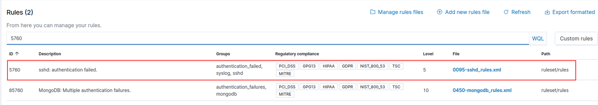

Here is a sample snapshot of a log generated when the SSH attempt fails.

3. Go to “Explore” ➔ “Discover” tab. Look up “sshd”.

- 💡 Need a failed login attempt.

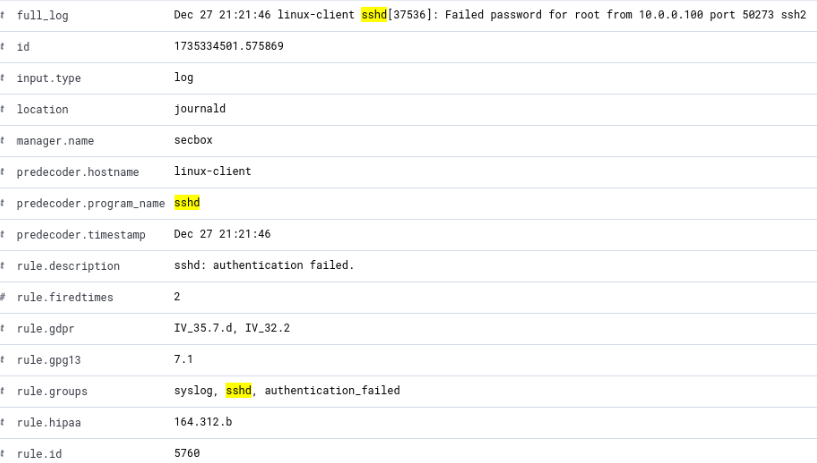

1. Create an alert for Failed SSH attempts. To do this, a Monitor will be set up to analyze logs. Based on certain conditions defined, a Trigger can be setup to open an Alert.
2. Go to “Explore” ➔ “Alerting”.

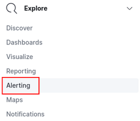

1. Select the “Monitors” tab on the top left.

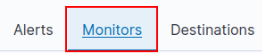

1. Select “Create monitor”.

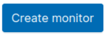

Here, create a new monitor.

1. Title the Monitor “3 Failed SSH Attempts”. Leave everything else default.

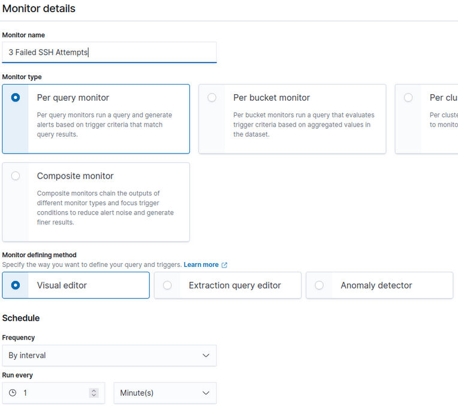

9. Scroll down to “Data source”. Add the following for the Index, hit the Enter key after typing: `wazuh-alerts-4.x-*`

1. For “Time Field” select: `@timestamp`

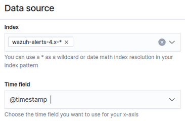

11. Next, add a query to select what logs and log fields user would like to monitor.

1. Based on a sample log of a failed ssh attempt, user can construct a query to monitor specific field or value key pairs.

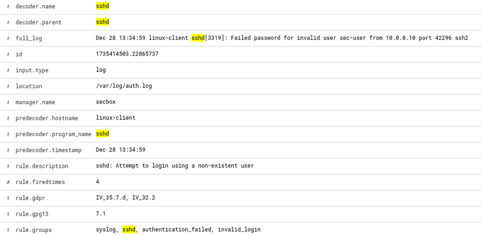

1. Navigate to the “Data filter” ➔ “+ Add filter”

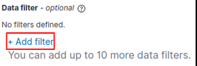

Based on the above sample log, let’s craft a query to select based on the “sshd” process name and the “authentication_failed” rule group.

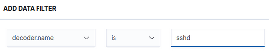

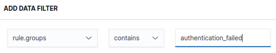

“Data filter” tab should now look something like this.

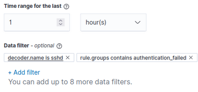

1. Let’s add a Trigger.

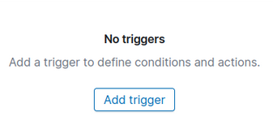

Add the following conditions to the Trigger. User set the “Severity level” to 3 (Medium) and the “Trigger condition” above 2.

So what user is doing here… Once user gets more than 2 logs that have met the following query conditions from above, an alert will be generated.

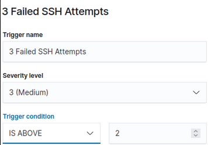

1. There’s also an “Actions” option. Here user could create an Email, Slack, or Microsoft Teams notification of the alert. User could also launch a playbook that would follow a specific instruction set to analyze, investigate, or isolate a host. User is not going to configure this section.

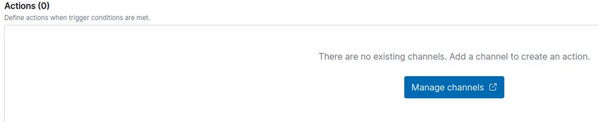

1. Scroll to the bottom and Select “Create”.

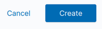

---

---

## [project-x-win-client]

An Event ID does not exist for Enabling Win-RM as a service. However, we can detect WinRM logins through the Event ID `4624` with a `logonProcessName` of Kerberos as WinRM uses Kerberos.

Once we have enabled Security Windows logs (this should have been done in the Setup Wazuh section), we should automatically get Windows Event Logs.

Wazuh has a built-in rule detection to detect successful and unsuccessful authentication attempts into a Windows machine. The Windows Security Event IDs are `4624` (for successful) and `4625` (for failed).

- Wazuh Rule ID: `60106`
- Description: User: `Windows Logon Success`
1. Navigate to “Server management” ➔ “Rules”. And look up “60106” to view more detail about this rule.

1. Go to “Explore” ➔ “Discover” tab ➔ Make sure `wazuh-alerts-*` is selected. Look up: `data.win.eventdata.logonProcessName: Kerberos`

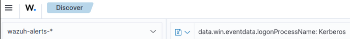

Here we can see the `logonProcessName`, the computer that was logged into, the EventID and the system message from a successful WinRM logon.

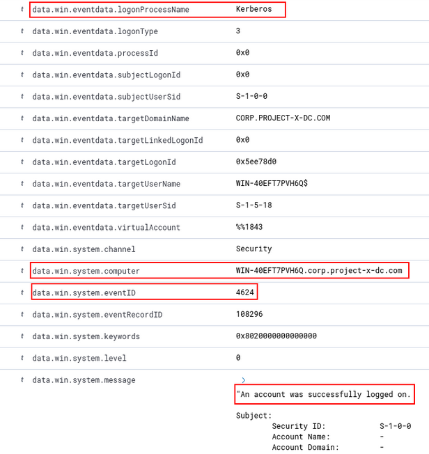

1. Let’s create an alert for WinRM. We will do something similar to the Failed SSH attempts.
2. Go to “Explore” ➔ “Alerting”.

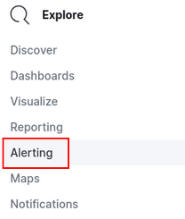

1. Select the “Monitors” tab on the top left.

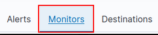

1. Select “Create monitor”

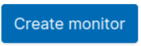

Title the Monitor “WinRM Logon”. Leave everything else default.

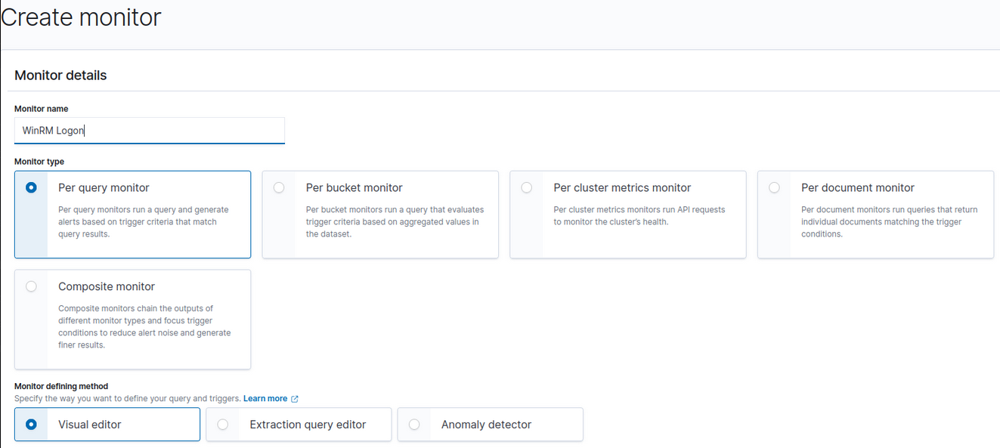

1. Scroll down to “Data source”. Add the following for the Index, hit the Enter key after typing: `wazuh-alerts-4.x-*`
2. For “Time Field” select: `@timestamp`

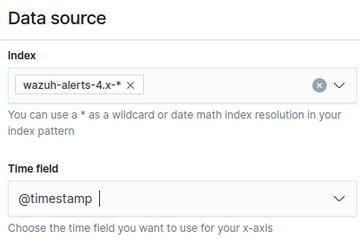

1. Next, add a query to select what logs and log fields we would like to monitor.

Based on a sample log of a WinRM attempt, we can construct a query to monitor specific field or value key pairs.

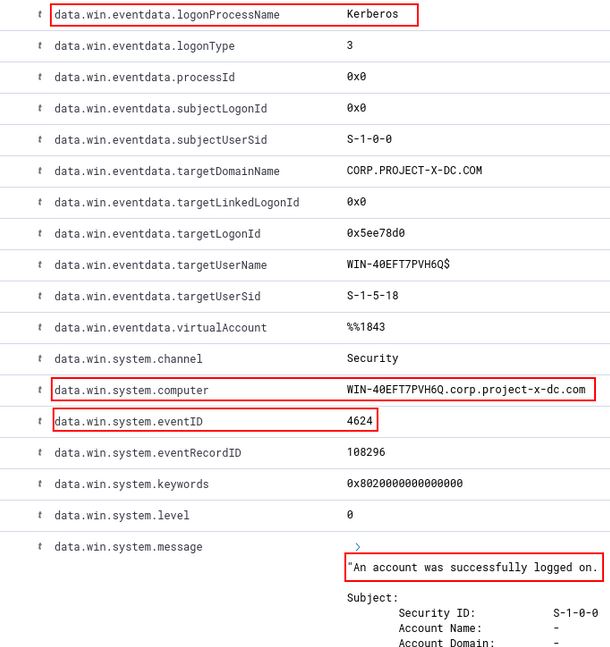

1. Navigate to the “Data filter” ➔ “+ Add filter”.

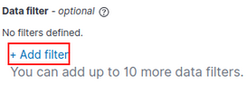

1. Based on the above sample log, let’s craft a query to select based on the “logonProcessName” and the “eventID” fields.

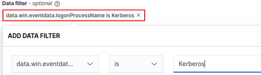

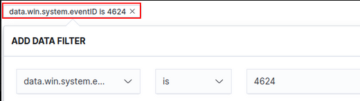

“Data filter” tab should now look something like this.

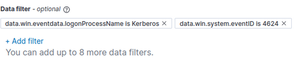

add a Trigger.

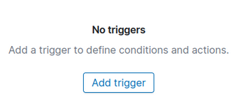

1. Add the following conditions to the Trigger. Set the “Severity level” to 3 (Medium) and the “Trigger condition” above 1.

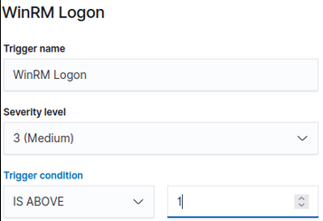

1. Scroll to the bottom and Select “Create”.

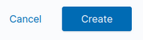

---

---

## [project-x-dc]

Wazuh has a built-in rule detection to detect successful and 
unsuccessful authentication attempts into a Windows machine. The Windows
 Security Event IDs are 4624 (for successful) and 4625 (for failed).

- Wazuh Rule ID: `92653`
- Description: User: `CORP\Administrator logged using Remote Desktop Connection (RDP) from ip:10.0.0.100.`

Navigate to “Server management” ➔ “Rules”. And look up “92653” to view more detail about this rule.

Here is a sample snapshot of a log generated when the RDP attempt was successful.

1. Go to “Explore” ➔ “Discover” tab.

Look up “4624”.

Or:

`data.win.system.eventID: 4624 ANDdata.win.eventdata.logonProcessName: User32`

1. Here we can see in the `rule.description`, that a successful logon attempt has been made.

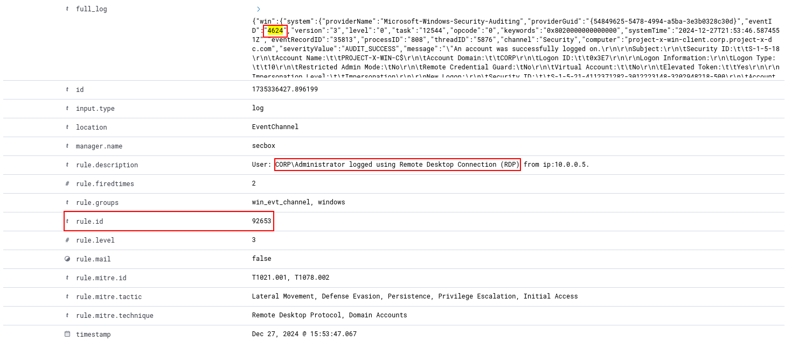

1. Navigate to “Server management” ➔ “Endpoint Groups” ➔ Select the “Windows” Agent Group.

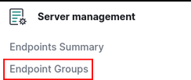

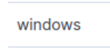

1. Select the “Files” tab ➔ agent.conf ➔ Select the Pencil Icon to edit the file.

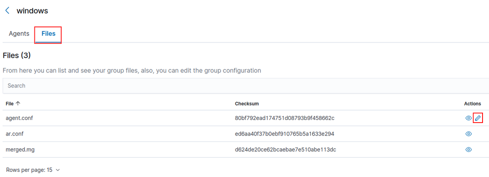

1. Add the following statement at the end of the file.

```jsx
 <syscheck>
  <directories check_all="yes" report_changes="yes"
  realtime="yes">C:\Users\Administrator\Documents\ProductionFiles
  </directories>
  <frequency>60</frequency>
 </syscheck>
```

1. Navigate to the “Endpoint security” ➔ “File Integrity Monitoring”.

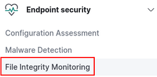

1. Under Inventory there should be a new file path populated. Make sure the `[project-x-dc agent]` is selected on the right. 

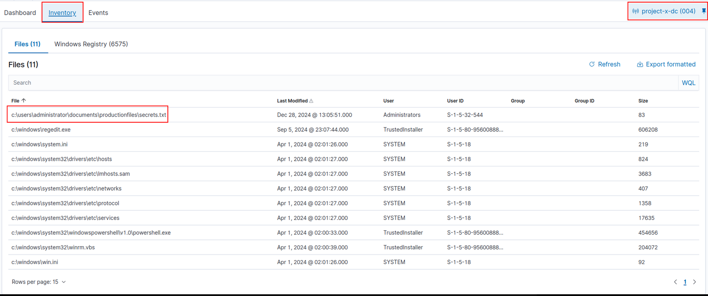

1. Navigating to the Events tab, if we were to change the content inside the secrets.txt file, we would have an event populate showcasing that the file has been modified. 

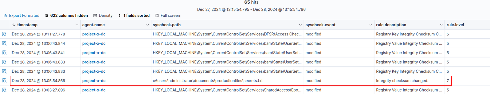

9. Let’s create an alert for accessing the *secrets.txt* file. This time, we are going to use the *local_rules.xml* file to define a custom rule to monitor for changes occurring.

First go to “Server management” ➔ “Rules”.

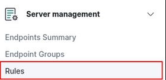

1. Search “local_rules.xml” ➔ Click the name under the File tab.

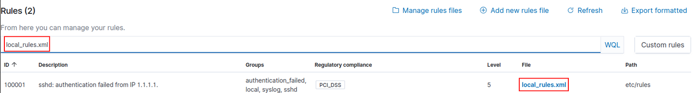

Leave the default rule.

1. Add the following statement to the bottom of the file.

```jsx
<group name="syscheck">
 <rule id="100002" level="10">
 <field name="file">secrets.txt</field>
 <match>modified</match>
 <description>File integrity monitoring alert - access to
sensitive.txt file detected</description>
 </rule>
</group>
```

Click “Save” ➔ “Restart”

1. After the console restarts.

Go to “Explore” ➔ “Alerting”

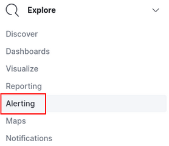

1. Select the “Monitors” tab on the top left.

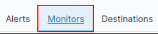

1. Select “Create monitor”

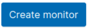

1. Here we can create a new monitor.

Title the Monitor “File Accessed”. Leave everything else default.

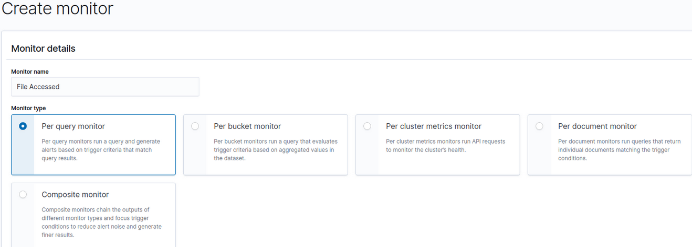

1. Scroll down to “Data source”. Add the following for the Index, hit the Enter key after typing: `wazuh-alerts-4.x-*`

For “Time Field” select: `@timestamp`

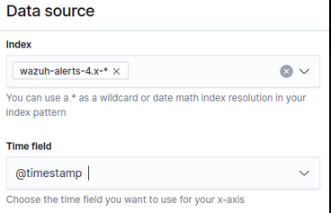

1. Next, we add a query to select what logs and log fields we would like to monitor.

Based on a sample log of a modified file attempt, we can construct a query to monitor specific field or value key pairs.

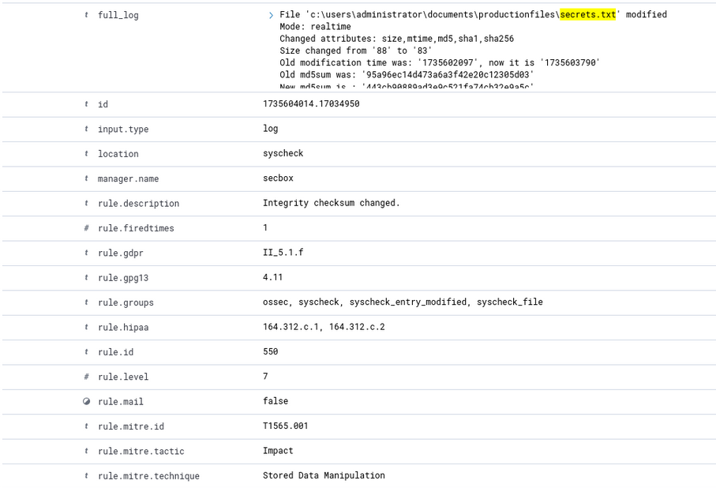

1. Navigate to the “Data filter” ➔ “+ Add filter”.

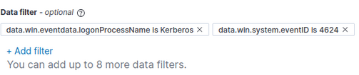

1. Based on the above sample log, let’s craft a query to select based on the “full_log” field containing the *secrets.txt* file and the “syscheck.event” fields to modified.

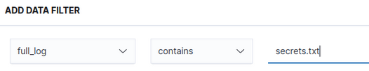

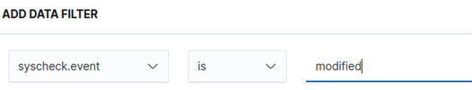

“Data filter” tab should now look something like this:

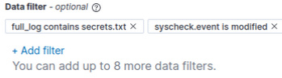

1. Let’s add a Trigger.


Add the following conditions to the Trigger. We set the “Severity level” to 2 (High) and the “Trigger condition” above 1.


Scroll to the bottom and Select “Create”.


---

---

## [project-x-attacker]

1. Open a new File Explorer Window ➔ Go to `C:\Windows\System32`.
2. Scroll down until you find “gpedit” ➔ Right-click ➔ Run as Administrator.
3. Go to Computer Configuration ➔ Administrative Template ➔ Network ➔ Lanman Workstation ➔ Double-click on “Enable insecure guest logons” ➔ Select “Enabled”. 


1. Go back to Powershell:

```powershell
Set-ItemProperty -Path "HKLM:\SYSTEM\CurrentControlSet\Services\LanmanWorkstation\Parameters" -Name AllowInsecureGuestAuth -Value 1 -Force
```